# Installation
1. Install the package: `pip install --no-build-isolation -e .`

# Usage

Use each script depending on the dataset you want to process for an LLM.

# Repository architecture

Each task is separate in it's own subdir. There are some shared functionality that you can
find in the src/utils folder.

```bash
├── assets
│   ├── configs                                 -> Configuration file for all task
│   ├── logging_config.json                     -> Logging base configuration
│   ├── genome_species_refseq                   -> List of species used for refseq downloading
│   └── molecules                               -> vocab.txt required for tokenizer
├── scripts                                     -> Global script for all tasks.
├── src                                         -> Main package
│   ├── compounds
│   ├── genome_sequence
│   ├── molecule_related_natural_language
│   ├── protein_sequence
│   ├── rna
│   └── utils
├── setup.cfg
├── environment.yaml
├── pyproject.toml
└── README.md
```

# Dataset preparation

All task have a global script that can be found in the `scripts` folder. They can be run with their corresponding configuration present in `assets/configs`.
The output will be multiple directory containing different step of the process.
If necessary it is possible to rerun only part of the full script by selecting the proper python file. See below for details.


# Dataset Statistics

- <b>RNA</b> (scRNAseq expression data)

    Size of the dataset: 221G

    Samples: 35,822,843-

    Tokens: 90,711,564,293

    Samples length size distribution of the full data: 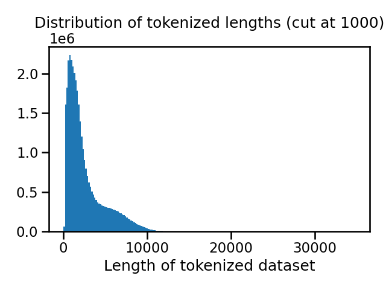

- <b>Protein Sequence</b> (Uniref 50)

    Size of the dataset: 18G

    Samples: 66,000,000

    Tokens: 19,182,955,286

    Samples length size distribution of the full data: 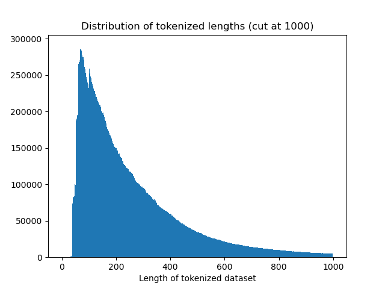

- <b>Compounds</b>:

    Size of the dataset: 954M

    Samples: 13,288,710

    SMILES Tokens: 526,014,485

    Scaffolds Tokens: 350,007,581

    Samples length size distribution SMILES: 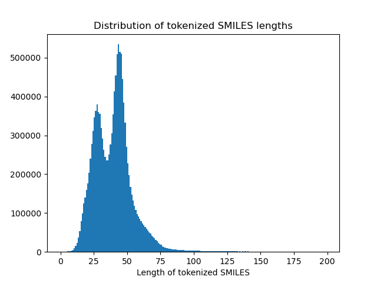

    Samples length size distribution Scaffolds: 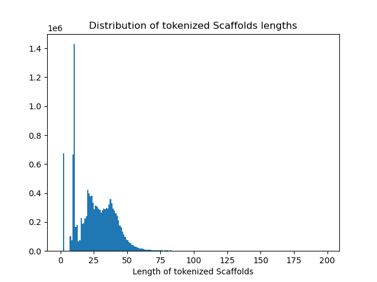

- <b>Molecule-related natural language</b>

    Size of the dataset: 8.9G

    Training Samples:

        Samples: 3,288,855
        Tokens: 460,447,039

    Validation Samples:

        Samples: 20,498
        Tokens: 2,568,952

    Test Samples:

        Samples: 33,061
        Tokens: 4,514,586

    Total:

        Samples: 3,342,414
        Tokens: 467,530,577


    Samples length size distribution Training Set: 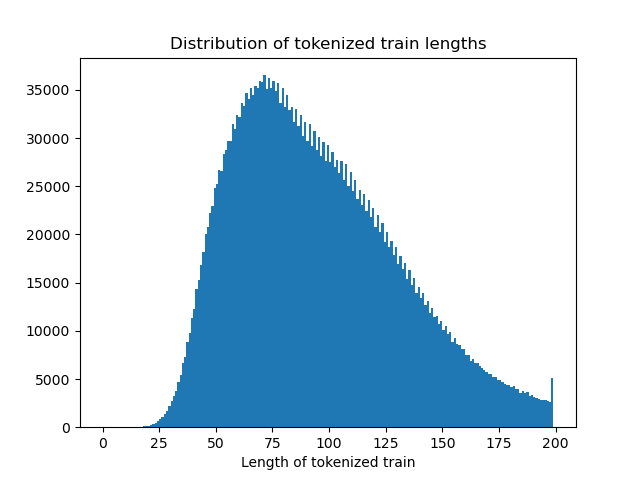

    Samples length size distribution Validation Set: 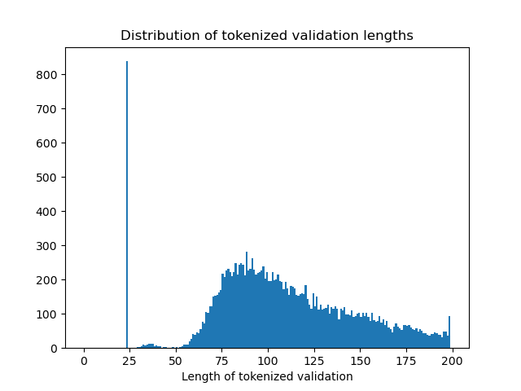

    Samples length size distribution Test Set: 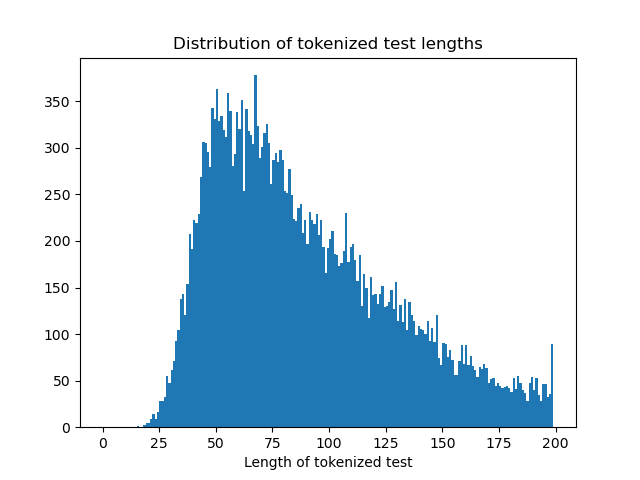


- <b>Genome Sequence</b> (status: still on going)

    Number of sequence: 248,678
    Size of the vocabulary: 4096
    Number of tokens: 3,025,575,847

    Samples length size distribution of the full data: 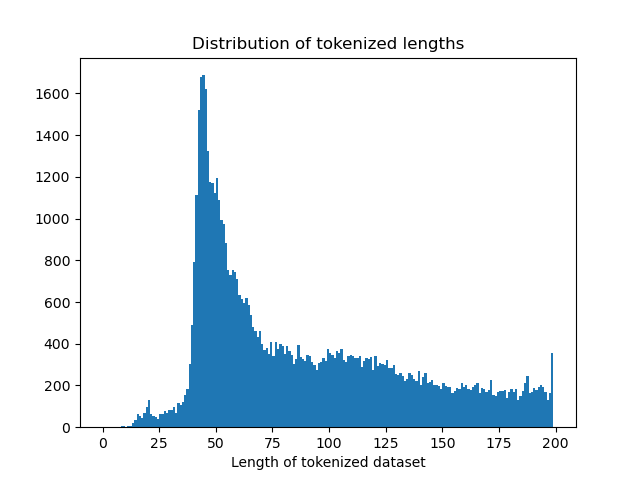


# Dataset Preparation Scripts

In this section it is introduced the scripts that download, process, and tokenize the datasets. The scripts are contained in the `scripts` folder and are run independently.

#### Running

Run each script following the syntax:

`python scripts/preparation_script_*.py assets/configs/*.yaml`,

where * is the intended dataset, and `assets/configs/*.yaml` is the configuration file for the specific dataset.

#### Logging
The script includes logging functionality, which is set up at runtime. The logs are saved to a file named `logging.log` in the directory where the processed dataset is saved.

#### Output
The output of the script will be a tokenized version of the dataset, saved in the specified path `save_path` in the `assets/configs/*.yaml`. The log file will contain details of the processing steps, as well as statistics for the dataset.

#### Error Handling
Any exceptions encountered during the execution are logged and re-raised, ensuring clear identification of issues during processing.


<!-- ------------------------------------------------------------------------------------------------------------- -->
## Compounds

The script `scripts/preparation_script_molecules.py` downloads the necessary files and creates the OrganiX13 dataset, processes it, and tokenizes it following the [LLamol](https://github.com/Fraunhofer-SCAI/llamol) repository's tokenizer.

The resulting is a parquet file that contains a `pyarrow.Table` with rows: "smiles", "logp", "sascore", "mol_weight", "tokens", and "scaffold_tokens". "smiles", "logp", "sascore", and "mol_weight" are contextual data; while "tokens", and "scaffold_tokens" contains the tokenized SMILES string and the tokenized scaffold respectively.

Before running the script, ensure you have the following:

1. **Config File**: A YAML configuration file (available in `assets/`).
2. **Vocabulary File**: A pre-trained vocabulary for SMILES tokenization (available in `assets/molecules`). This can be modified in the Config File.

### Configuration

```yaml
data_preparation:
  # Path to save the untokenized OrganiX13 dataset once is downloaded and processed by the script
  organix13_dataset: "src/compounds/dataset/organix13"

  # Path to save the processed and tokenized dataset
  save_path: "outputs/organix13_tokenized.parquet"

  # Path to the vocabulary
  vocab_path: "assets/molecules/vocab.txt"

  # Max length of the tokenized sequences
  max_length: 256

```

### Running the Script

You can run this script with the following command:

```bash
python scripts/preparation_script_compounds.py assets/configs/compounds.yaml
```

#### Loading a Processed Dataset

To load a dataset that was generated by this script, use:
```python
from core.base import read_parquet

tokenized_dataset = read_parquet("path/to/organix13_tokenized.parquet")
```


<!-- ------------------------------------------------------------------------------------------------------------- -->

## Genome Sequence

You can run this script with the following command:

```bash
python scripts/preparation_script_genome_sequence.py assets/configs/genome_sequence.yaml
```

### Configuration

```yaml

data_preparation:
  # Output directory where the preparation will be made
  output_dir: "/nasa/datasets/riken/projects/fundamental_models_202407/refseq"

  # Path to a directory containing one file per species to download from refseq (see assets/genome_species_list/species for example)
  # Possible groups are archaea, bacteria, fungi, invertebrate, metagenomes, plant, protozoa, vertebrate_mammalian, vertebrate_other, viral.
  path_species: "assets/genome_species_list/filtered_species_refseq"

  # Num of parallel worker to use, note that for download the worker are capped to 3
  num_worker: 16

  max_lines_per_file: 10000

  # Size of the vocabulary of the BPE tokenizer
  vocab_size: 4096

  # Number of genome sequence to use to train the BPE tokenizer.
  # We will sample input_sentence_size randomly from input_sentence_size * 2 number of sequence.
  # So input_sentence_size * 2 / max_lines_per_file will be randomly selected for the BPE training.
  input_sentence_size: 700000
```


### Separate scripts

The processing of Refseq is separate in 4 separate scripts. These scripts except the result
of precedding directory to be present in the `output_dir` if that's not the case the scripts won't work.

- `src/genome_sequence/dataset/refseq/download_refseq.py`

    Uses `https://github.com/kblin/ncbi-genome-download` to download refseq data.
    `path_species` provide the directory containing one file per group and containing
    the name of the species to use. You can check the data base names here: https://www.ncbi.nlm.nih.gov/datasets/genome/

    Note that a lot of species used by scFormer where absent from refseq, so we only use the remaining ones.
    The full original species can be found in `assets/genome_species_list/species`
    And we used a filter set containing species with at least one sequence in refseq `assets/genome_species_list/filtered_species_refseq`


- `src/genome_sequence/dataset/refseq/fasta_to_raw.py`

    Generate the `raw_files` directory containing smaller raw file of size `max_lines_per_file` (total of 1.6TB)

- `src/genome_sequence/dataset/sentence_piece_tokenizer.py`

    As per specification we tried to train a BPE trainer from the raw files we generated. We provided an implementation with
    DNABERT_2, but in our experience the Hugging face implementation is too memory and time consuming.
    So our implementation uses the sentence piece library to train on a subset of the dataset.
    It's only one solution to use the pretrain Tokenizer trained by the DNABERT_2 authors.
    We left commented code in `src/genome_sequence/dataset/tokenizer.py`. In that case
    there is no need to train a new bpe tokenizer.

- `src/genome_sequence/dataset/tokenizer.py`

    Convert the raw files in parquet files of tokens in the `parquet_files` directory. The trained BPE Tokenizer was used to confirm the usage. Here we used Hugging Face library to load the raw files, but it is also possible to use a script similar to the one in the protein sequence version (not implemented here).


<!-- ------------------------------------------------------------------------------------------------------------- -->

## Molecule Related Natural Language

The script `scripts/preparation_script_molecule_related_nat_lang.py` preprocess and tokenizes a natural language molecule dataset. THe data is downloaded from [SMolInstruct](https://huggingface.co/datasets/osunlp/SMolInstruct). Then following the project's [GitHub repo](https://github.com/OSU-NLP-Group/LLM4Chem/tree/main), the data is preprocessed to have a "chat"-like format, following questions and answers. After this formatting of the data, the samples are tokenized and saved in a folder defined in the config file. This folder is a HuggingFace DatasetDict object which uses parquet.

The resulting file is a dictionary for 3 dataset splits: "train", "valid", and "test". Each of them have the features: "sample_id", "input", "output", "raw_input", "raw_output", "split", "task", "input_core_tag_left", "input_core_tag_right", "output_core_tag_left", "output_core_tag_right", "target", "input_text", "real_input_text", "input_ids", "attention_mask", "labels", "output_ids". From these, the most relevant are:

* input_text: contains the untokenized input
* output: contains the ground truth output
* input_ids: contains the tokenized input
* output_ids: contains the tokenized outputs

### Configuration

```yaml
  # Path to save the dataset once is downloaded
  dataset: "src/molecule_related_nl/assets/raw_data/osunlp/SMolInstruct"

  # Path to save the processed and tokenized dataset
  save_path: "outputs/molecule_related_natural_language_tokenized.parquet"

```

### Running the Script

Before running the script, ensure you have the following:

1. **Config File**: A YAML configuration file (available in `assets/`).

You can run this script with the following command:

```bash
python scripts/preparation_script_molecule_related_nat_lang.py assets/configs/molecules_nl.yaml
```

#### Loading a Processed Dataset

To load a dataset that was generated by this script, use:
```python
from molecule_related_nl.utils.general import read_dataset
from datasets import DatasetDict

tokenized_dataset = DatasetDict(read_dataset("path/to/the/folder/created/by/script"))
```

<!-- ------------------------------------------------------------------------------------------------------------- -->

## Protein Sequence

You can run this script with the following command:

```bash
python scripts/preparation_script_protein_sequence.py assets/configs/protein_sequence.yaml
```

### Configuration

```yaml
  # Which uniprot dataset to download must be one of the following:
  # "UniprotKB_reviewed", "UniprotKB_unreviewed", "UniRef100", "UniRef90", "UniRef50", "UniParc"
  dataset: "UniRef50"

  # Output directory where the preparation will be made
  output_dir: "/nasa/datasets/riken/projects/fundamental_models_202407/uniprot/"

  # If True use md5 to check if a file needs to be downloaded again, using md5
  # is very time consuming for large file. Otherwise we only check if the path exists.
  use_md5: False

  # Special case for Uniparc download, num of worker to use.
  num_worker: 4

  # Number of sequence per files for raw files and parquet. It also reflex the number
  # of sequence loaded in memory during the processing of those files.
  max_lines_per_file: 10**6
```
### Outputs

The output will be the a subdir of the output_dir containing a dataset name directory (ex: uniprot_50) containing the rest of the file:

- Archive file, for uniprot a `archive` dir will be creating containing all the files
- A fasta file extracted from the archive, for uniprot a `fasta_file` directory will be created containing all the file.
- A `raw_files` directory containing multiple file with one protein sequence per line.
- A `parquet_files` directory, containing two column parquet file tokenized sequence ("token") and the number of ("token_count")
- A `token_counts.pkl` file which contains a list of int corresponding to token_count for computing statistics of the dataset.

### Separate scripts

The processing of Uniprot is separate in 3 separate scripts. These scripts except the result
of precedding directory to be present in the `output_dir` if that's not the case the scripts won't work.

- `src/protein_sequence/dataset/uniprot/uniprot_download.py`

    Will download all uniprot files and extract them to fasta files.

- `src/protein_sequence/dataset/uniprot/fasta_to_raw.py`

    Generate the `raw_files` directory containing smaller raw file of size `max_lines_per_file`

- `src/protein_sequence/dataset/tokenizer.py`

    Convert the raw files in parquet files of tokens in the `parquet_files` directory. The ESM Tokenizer is used.
    The `token_counts.pkl` is also generated.

<!-- ------------------------------------------------------------------------------------------------------------- -->
## RNA

You can call this script with the following command:

```bash
python scripts/preparation_script_rna.py assets/configs/rna.yaml
```

One limitation of the rna sequence task is the fact that the sequence data are continuous and therefore
it creates a challenge for the tokenization and the model. The tokenization is made based on geneformer model. We used their code and statistics to compute our own tokenization. This is motivated by the similarity of both dataset.

### Configuration

```yaml
data_preparation:
  # Output directory where the preparation will be made
  output_dir: "/nasa/datasets/riken/projects/fundamental_models_202407/cellxgene"

  # Special case for Uniparc download, num of worker to use.
  num_worker: 8

  # Size of list of ids to give to each worker, save file will have `size_workload` number of ids in them.
  size_workload: 10000

  # Version of the CellxGene census
  census_version: "2023-12-15"

  # Filter condition to filter genes with few counts across a dataset.
  min_counts_genes: 2
```

### Outputs

This script will download the cellxgene dataset.
There will be multiple directory generate in the output_dir provided in the configuration

- `metadata_preparation`: containing `.tsv` files with ids to download
- `tissue_list.tsv`: List of tissue taken into account.
- `download_dir`: Raw archive file downloaded from the cellxgene database
- `extract`: h5ad file extracted from the archives
- `loom_dir`: loom files ready to be use for the tokenization
- `parquet_files`: parquet files containing tokenized gene and expression values

### Separate scripts

The is 4 separate scripts for cellxgene downloading.

- `src/rna/dataset/cellxgene/script/build_list.py`

    Generate `metadata_preparation` and `tissue_list.tsv` to prepare the download.

- `src/rna/dataset/cellxgene/script/download.py`

    Actual downloading of the data in `download_dir` directory.

- `src/rna/dataset/cellxgene/script/conv.py`

    Extract h5ad files form the archived in `download_dir` and save them to the `extract` directory

- `src/rna/dataset/cellxgene/script/h5ad_to_loom.py`

    Transfer the h5ad file to loom and delete some unnecessary entries.

- `scr/rna/dataset/cellxgene/tokenization.py`
    Create the gene token vocabulary, based on geneformer code.


# Training of GPT2 model

For the GPT2 base code we use the [nanoGPT](https://github.com/karpathy/nanoGPT) code. We only change
the way the dataset is loaded.

In order to train a gpt2 model with one the dataset, you will need to run the `prepare_gpt2.py` script in
`{task}/dataset`, for example for `protein_sequence` you can run the following command.

```bash
python src/protein_sequence/dataset/prepare_gpt2.py assets/configs/protein_sequence.yaml
```

This will prepare the dataset in batch and make sure the context_size, here of 1024
is filled without any padding.

Then the training can be launch, for the prepared protein sequence dataset, by running the following:

```bash
python gpt2/train.py gpt2/data/protein_sequence/train_gpt2_config.py
```

this will train a model and save it in outputdir.

Then you can sample some example with the following

```bash
python gpt2/sample.py gpt2/data/protein_sequence/train_gpt2_config.py
```

For more information, check the README in the folder `gpt2`.

# Training of the BERT model

For the BERT model training we are using a custom script based on the Hugging Face Transformers library. The script is located in `src/bert/main.py` and can be run with the following command:

The dataset used are the same as the ones for GPT2, since we already tokenize them we just need to randomly mask part of the tokens.

You can find the list of configs in `bert/configs`. Most parameter are similar to the ones in the gpt configuration. However, there is a `model_size` parameter that let you choose between small medium and large models. Note that medium correspond to BERT-large size, but we call it medium since the size in terms of parameter is close to GPT2-medium. The large model is a custom size bert model witch matches the gpt2 large size.

To run a training you can use the following command:

```bash
python bert/main.py bert/configs/molecule_nl.py
```

this will train a model and save it in outputdir.

# Genome sequence training with mixed species GPN-MSA

There is a separate readme inside the `gpn` folder, detailling how to train and run inference for this task.


### Generated Samples

After training the datasets with a few iterations with the above-mentioned scripts, we provide some generated outputs, to show the ability of GPT2 to learn from the datasets -- as requested by the project description.

#### Compounds

After training 1,600 iterations on 15,000 samples, the sampling produced:

```
O C C 2 ) C ( = O ) N 1 C c 1 c c c ( N 2 C C C C 2 = O ) c c 1 [SEP] [CLS] [CLS] C N ( C ( = O ) C 1 ( N C ( N ) = O ) C C 1 ) C ( C ) ( C ) C ( = O ) O [SEP] [CLS] [CLS] C N C ( = O ) N C C ( = O ) N C [C@] 1 ( O ) C C N ( C ( = O ) C [C@@H] 2 C C C O 2 ) C 1 [SEP] [CLS] [CLS] C O C 1 = C C = C C ( = C 1 ) N ( [C@@H] 2 C S ( = O ) ( = O ) C = C 2 ) C ( = O ) C 3 = C C = C C = C 3 [SEP] [CLS] [CLS] C [C@H] ( O ) [C@H] ( C ) [C@@H] 1 O [C@H] 1 C C 1 C O [C@@H] ( C C 2 = C C ( = O ) O C 2 ) [C@H] ( O ) [C@@H] 1 O [SEP] [CLS] [CLS] C c 1 n c ( C C ( = O ) N C C 2 ( N C c 3 n c ( = O ) n ( C ) [nH] 3 ) C C C C 2 ) n [nH] 1 [SEP] [CLS] [CLS] C C ( C ) ( C ) C 1 = C C = C C = C 1 C ( = O ) C = C C 2 = C C = C C = C 2 O C [SEP] [CLS] [CLS] C = C C N C ( = O ) c 1 c c c c n 1 [SEP] [CLS] [CLS] C C ( C ) ( C ) C N C ( = O ) C N C C ( = O ) N [C@H] 1 C C ( = O ) N 1 [SEP] [CLS] [CLS] C N ( C ) C C ( C ) ( C ) O c 1 c c c c c 1 ) C ( = O ) c 1 c c c c c 1 [SEP] [CLS] [CLS] C 1 C [C@@H] ( N C ( = O ) C 1 C C 1 ) N 1 C C C C C 2 ( C C 1 ) C N ( C ( C ( C ) ( C ) ( C ) C ) C ) C 2 [SEP] [CLS] [CLS] C C ( C ) N 1 C [C@@H] ( C 1 ) O C [SEP] [CLS] [CLS] C C O C 1 = C C = C ( C = C 1 ) [C@H] ( C 2 = C 3 C = C C = C 3 O 2 ) C 4 = C C = C C = C 4 [SEP] [CLS] [CLS] C 1 [C@H] 1 [C@H] ( [C@H] ( [C@@H] ( [C@H] ( [C@@H] ( O 2 ) C 1 O ) C O ) C ( = O ) O ) O ) O [SEP] [CLS] [CLS] C C [C@@H] 1 C [C@@H] ( C C 1 ) C c 1 c ( C ) n c ( C ) n 1 ) O [SEP] [CLS] [CLS] C C ( C ) ( C ) ( C ) c 1 c c c c c 1 N C C C O ) O [SEP] [CLS] [CLS] C c 1 c c c 2 c ( = O ) n ( C c 3 c c c c c 3 ) c ( C ) n c 3 c ( C ( C ) C ) n n c 3 ) n c 1 2 [SEP] [CLS] [CLS] C C C C C N [C@@H] ( C C C C N ) C C ( = O ) C n 1 c n c n 1 [SEP] [CLS] [CLS] C [C@@H] ( C ( = O ) C C C 1 ( O ) C C 1 ) N C ( = O ) N C C C n 1 c c c n 1 [SEP] [CLS] [CLS] C O C ( = O ) c 1 c c c ( S ( = O )
---------------
O ) N C 1 C N ( C ( = O ) [C@H] 2 C C C O C 2 ) C 1 ) c 1 c n n ( C ) c 1 [SEP] [CLS] [CLS] C C / C ( = C ( \ c 1 c c c c c 1 ) c 1 c c c ( O C C [N+] ( C ) ( C ) C C ) c c 1 ) c 1 c c c c c 1 [SEP] [CLS] [CLS] C C C N ( C C N ) c 1 c n c c ( n 1 ) O C C [SEP] [CLS] [CLS] O = C ( C N 1 C C O C 1 = O ) N [C@H] ( C O ) c 1 c c c c n 1 [SEP] [CLS] [CLS] C N C ( = O ) C N C 1 C C 2 ( C 1 ) C C ( N C ( = O ) [C@@H] ( C ) [C@H] 1 C C C ( = O ) N 1 ) C 2 [SEP] [CLS] [CLS] C c 1 c 2 O C C c 2 n o 1 [SEP] [CLS] [CLS] N C ( = O ) c 1 c [nH] c ( C ( = O ) N C C 2 ( O ) C N ( C c 3 c n n s 3 ) C 2 ) c 1 [SEP] [CLS] [CLS] C n 1 c ( N ) c ( Cl ) c ( C ) c 1 C ( = O ) N [C@@H] 1 C N ( C ( = O ) C c 2 c c c c ( = O ) n 2 ) [C@@H] ( C ( N ) = O ) C [C@H] 1 n c c n 1 [SEP] [CLS] [CLS] C c 1 c c c ( C ( = O ) [C@H] ( C ) [C@H] 1 C ) c 1 c c c 2 c c c c c 2 n 1 [SEP] [CLS] [CLS] C 1 C [C@H] ( [C@H] ( [C@H] ( C 1 ) O C ( = O ) C C 1 ( C ) C C O C C 1 ) N C c 1 n c c ( - c 2 n n [nH] n 2 ) n 1 ) S ( N ) ( = O ) = O [SEP] [CLS] [CLS] C c 1 c c c c 2 c ( c 1 ) c ( n c n 2 C c 1 c c c c c 1 ) N [SEP] [CLS] [CLS] C C ( C ) C [C@H] 1 N = C ( [C@H] 1 C O C C ( = O ) N 1 C [C@H] ( C ) C C C N ) O [SEP] [CLS] [CLS] c 1 c c 2 c ( c 1 ) C ( = O ) c 1 c c c ( c c 1 ) / N = C / N 1 C C S 1 ( = O ) = O [SEP] [CLS] [CLS] C C c 1 c c c ( C C ( = O ) N 2 C [C@@H] 3 C C [C@@H] 2 C N 3 C ( = O ) [C@@H] ( N ) C n 2 n c c n 2 ) n o 1 [SEP] [CLS] [CLS] C C C O c 1 c c c ( N C ( = O ) C 2 ( O ) C N ( C C ( = O ) N C ( = O ) C C c 2 c c c c c 2 ) C C N 2 C C O C 2 ) c c 1 [SEP] [CLS] [CLS] C C N ( C C ( = O ) N [C@@H] 1 C N ( C ( = O ) C c 2 c n n ( C ) c 2 ) C 1 ) C [C@H] 1 C C C S ( C ) ( = O ) = O [SEP] [CLS] [CLS] C C ( C ) ( C N C ( = O ) N 1 C C C ( C C 1 ) ( [C@@H] ( C ( F ) ( F ) F ) O ) O ) O [SEP] [CLS] [CLS] C C O C C (
```

which contains valid SMILES within the text, for example:
* "[CLS] C C C C C N [C@@H] ( C C C C N ) C C ( = O ) C n 1 c n c n 1 [SEP]" translates to 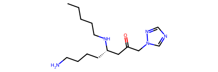
* "[CLS] C C ( C ) ( C N C ( = O ) N 1 C C C ( C C 1 ) ( [C@@H] ( C ( F ) ( F ) F ) O ) O ) O [SEP]", translates to 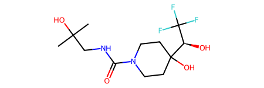

showing understanding of the underlying data.

#### Molecule Related Natural Language

After training 9,620 iterations on 10,000 samples, the sampling produced:

```
</s><s> [INST] <SMILES> CC1=CC=CC(C2=CC=CC=C2C(=O)O)=C1.ClCCl.Cl[Sn](Cl)(Cl)Cl.O=C([O-])O.O=S(Cl)Cl.[Na+] </SMILES> Given the above reactants and reagents, what could be a probable product of their reaction? [/INST] A probable product could be <SMILES> CC1=CC=CC2=C1C(=O)C1=CC=CC=C12 </SMILES> .</s><s> [INST] Convert the SMILES representation of a molecule <SMILES> CC(=O)N1CCC(C(=O)N(C)CCOC2=CC=C(F)C=C2)CC1 </SMILES> into IUPAC name. [/INST] <IUPAC> 1-acetyl-N-[2-(4-fluorophenoxy)ethyl]-N-methylpiperidine-4-carboxamide </IUPAC></s><s> [INST] <SMILES> COCCOC1=CC2=NC=CC(OC3=CC=C(N(C(N)=O)C4=CC=CC(S(C)(=O)=O)=C4)C=C3)=C2C=C1C#N </SMILES> Given the product provided, propose some possible reactants that could have been employed in its formation. [/INST] Here are possible reactants: <SMILES> CCN(C(C)C)C(C)C.COCCOC1=CC2=NC=CC(OC3=CC=C(N)C=C3)=C2C=C1C#N.CS(=O)(=O)C1=CC=CC(NC(=O)OC2=CC=CC=C2)=C1 </SMILES> .</s><s> [INST] Provide the potential reactants that may be used to produce the product <SMILES> COC1=CC=CC([C@H]2O[C@H](CC(=O)O)C(=O)N(CC(C)(CO)CO)C3=CC=C(Cl)C=C32)=C1OC </SMILES> . [/INST] The potential reactants: <SMILES> CCOC(=O)C[C@H]1O[C@H](C2=CC=CC(OC)=C2OC)C2=CC(Cl)=CC=C2N(CC(C)(CO)CO)C1=O </SMILES> .</s><s> [INST] Can you list the reactants that might result in the chemical product <SMILES> CS(=O)(=O)N1CCC(NC2=NC=C3C(C4=CC=CC(F)=C4)=NNC3=N2)CC1 </SMILES> ? [/INST] <SMILES> CS(=O)(=O)N1CCC(N)CC1.FC1=CC=CC(C2=NNC3=NC(Cl)=NC=C23)=C
---------------
C=C/C1=CC=CC=C1.O=C(O)C1=CC=CC=C1S.[Pd] </SMILES> as the reactants and reagents? [/INST] Sure. A potential product: <SMILES> CNC(C)COC1=CC(F)=CC=C1C(=O)N1CC2=NN3C(C)=C(Cl)C(C)=NC3=C2C1 </SMILES> .</s><s> [INST] Please provide a feasible product that could be formed using these reactants and reagents: <SMILES> C1CCOC1.CC(C)C[Al+]CC(C)C.CCOC(=O)C1CC=CC2CNC(=O)C21.CO.COC(C)(C)C.O.[H-] </SMILES> . [/INST] <SMILES> OCC1CC=CC2CNCC21 </SMILES></s><s> [INST] <IUPAC> (2E)-2-(1-hydroxy-2-phenylethylidene)-5,5-dimethyl-3-(2-methylphenyl)iminocyclohexan-1-one </IUPAC> The above is the IUPAC name of a molecule. Write its molecular formula. [/INST] <MOLFORMULA> C23H25NO2 </MOLFORMULA></s><s> [INST] <IUPAC> 2,4-difluoro-3-(quinolin-3-yloxymethyl)aniline </IUPAC> is the IUPAC name of a molecule. Please give its SMILES representation. [/INST] <SMILES> NC1=CC=C(F)C(COC2=CN=C3C=CC=CC3=C2)=C1F </SMILES></s><s> [INST] <SMILES> CC1=NNC(C)=C1CNC(=O)C1CCCN(CC(N)=O)C1 </SMILES> The above is a SMILES representation. Write the IUPAC name of the corresponding molecule. [/INST] <IUPAC> 1-(2-amino-2-oxoethyl)-N-[(3,5-dimethyl-1H-pyrazol-4-yl)methyl]piperidine-3-carboxamide </IUPAC></s><s> [INST] Can you identify the reactant(s) that might result in the given product <SMILES> COC1=C(N)C=CC(CC#N)=C1C </SMILES> ? [/INST] <SMILES> COC1=C([N+](=O)[O-])C=CC(CC#N)=C1C </SMILES></s><s> [INST] Translate the given SMILES formula of a molecule <SMILES> CC(C)CCNC(=O)CS(=O)C1=CC=C(F)C=C1N </SMILES> into its IUPAC name. [/INST] <IUPAC> 2-(2-
```

which show a coherent _instruction_ -> _answer_ exchange. Additionally, valid SMILES can be identified, for example:

* `<SMILES> CC(C)CCNC(=O)CS(=O)C1=CC=C(F)C=C1N </SMILES>` which translates to:
    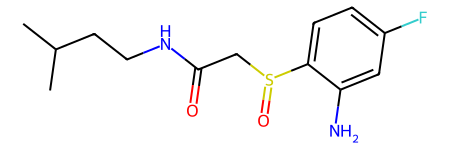

displaying understanding of the underlying data.


#### Protein sequence

We get the following after training around 4,000 iteration on a 10,000 samples dataset:

```
G G L R I E T T I R D V Y Q T P N L D E C R R I V E G E V Q I K I G E D L P T R I M F <eos> M P T Y L P P N K L L Q K L P I A R N I D P P Y E L F R H K E E Q K I E M L I D N I D N V I Q P S W K T S K D Q E T E K Y F Q W I G N I P G F P C P G T S E W E D P K H H Y E M H R Q H D E W L D N L K G P A F S H Y E T Y A K D I E Q H L S D V I E E M D G S P P I E P C S E L P K S G H P I S G Y F V A Q P T T N E V L C E S P L V Q K I K R A <eos> M P F S R S L F I F L L L L F S L R L R Y R Q G N T Y S D S P Q E D I T L Y V L D A N Q G R F A L M N V A D T F D S G N I V N A G K A L M L K M T V W T D Y Y G V G A R G N I S R K K I N E V A K R P A Y E L W A I S R E R N V V A E N D I A Y I E L R R Q Q T Y K E M A S M T A A I V G R L P V I A S G V Q A L A I L P D V E V S M V R G N A Y T A G T L K P V V R S S R E M L G V A Y I Y V G K G Q D T A F D E A L I N R E A V I P S L L V C V V E Q G N S L T I R E L A L T N P T D T E A E L G V T M S T T E A I V N L R P P Y <eos> M E Q K E V D V T V G W L G E L V V C V G T P S I H I R V
---------------
M C Q R F L F L R E D G T L F R E G E F Q F S Y V Y I V D A G N C K I F W R T P C T Q C Q W Y C P V R R S L Q T R G F V L I L D L S S L K K S L I V K A G N S C R Y I K K I T M K R Q Q R R K T V S V P N Q P F I A D N D P N F S T S V P A P T T P P H S E T M P D F I P S P P P I P V T D D R D M S R L K P T F H T T D P P V D D T N L I A H R D P R D T N R P D Y F W L D T N D F Q Q F R S P Y G Y V T E G D S W Q T V G P F P S K A P Q S A L S Q Q S I S P V D E D Y T T F Y E M R E D L I Q A I N T D V V V K F G R N D L L T V P T G G S S G S P S S E E N I A G L I D D L G A V A N K F S S Q Q Y E E P K T F L P S S S G P Q S A S P I Y R P D Q A S G F Y I S G F E S G N I T I K W Q G D V A G L V Q G E V G F K T K L P N D F G P S S S T S I K P S S L L F T Y N S I T I R P D E K F L D T T L S S Q K F T P Y L Q A P T T Q P Q L V S S R P I Y S D K E M S M I T D V Q Q Q Q P V P F E N M F L L V R D N R S K Y D D D T C T I N G P Y S A K H G N H K R E K N C P I F Y T L G R R T K K P A T Y N K T F I R A R R S S K P T K
```

Evaluating the validity of the protein presented sequences requires deep understanding of the proteins, and is out of the scope of the exercise.


#### Genome sequence

We get the following result after training around 5000 iteration on a 10,000 samples dataset:

```
GTGCGACCTGGCCGGAACTCCACCACCGCGGCTGCTGAGTGGATACCTGGCTCAGAGACGGTTTTCGTTAACCATCCGCGCCACATGGAGAGTCAGGTACGTGACTTCGTCGGCGGTGAGGGGCTCTCCCAGCCTGAGCTCCAGGACAGTCTGAAGCTTAAGGGCAGTGGCGTAGGCATCCGGGTAGGAGTCATTGATTGCGGCACGGAGTTTGCCGGCGCTCTCTTCGATCTGTCTTCCGGAATTGGCGCGAACAAAGAAGTAGCGCAAGTGGGTGATGAAACGGGCAGCATTGACCGTATTCCGGTCGAAGCCGCGCCCGTAGGCCTGTTCCAGCACCTCGAAGAGTTGGGTGAAGAGTCCCGTCATCTGGTACGTGTAAGAGAGGTCTCCCGTGGCGAAGCCAGCATTGACCAAATGCAGGGCGATAGCCACCTCCTCATTGTCATCCAGCGGCTCATCCAGCCGTGAATTCACGAACTGGAGTATGCGTTGCGCCGCCCGCAGTTCCAGCGGGTAGAGATGCGACACCTCTGTCCGGAGAGGGTAGTCGAAATCCAGGCCCATCCGGCGCCGCTTGATCGCGAAGCTGAGATGATCGGCCAATGCCACCGAGAGTACCGTGCTTCCGGGAATGTGCATCTCGTCGCGGCCGGCTTCGAGTGCTTGTTCCGCGAGCAGGAGGTGTTCAGGAGGAATGGCCGCAACCATGGCACCGAGATTGTCAGGATCCCGGCCGTCCTCCGGTACGAAGGTGCGCAGCACCTTCGCCGGGTCCACGACCTGGCCTGCCTTCGCTTGAAAACCCAAGCCCCGTCCGGTGAGTATCACCTCCCGGCCGTTCCGATCCCGTGAAAGAACGACGTTGTTGTTGAAGACGCGCAGAATTTCCACGTCGTTGTAACTCCTGCCTCTGTAAGTGAACAACAGGACGGGGCAGGATGCCCCGTCCTGTTGGAGATCAGGCGACTGTTACGCCGTTGTCCACTACTGCACCGTTGCTCGCGATGACGTCCCGGTACCAGCCAAAGGACTTCTTCCGGTACCGCTCCAAGGTACCCGTGCCGTCGTCGTTCCTGTCCACATAGATGAAACCGTAACGCTTGCTCAGCTGCGCCGTGGTAGCGCTGACGATGTCGATGCAGCCCCATGAGGTGTATCCCAGGACCTCGGCGCCGTCTGCGATGGCTTCGCGGACCTGAACGAGATGGTCGTTCATGTAGTCGATGCGGTAGTCGTCCTCCACGGTCAGAGATCCCTCAGCCGTGAGCTCGTGGGAGAGTGCGGCACCGACGGCGATGGCCGGCAGATCCGTGAGGACTGCAGCCACTGTTTCCATTTGTCGATACCGGGCGTGGAGTCTTCCACCCGCTTGTTCAGGTCCGCGATCTGCTCCCCGAGCGCCGGGTTTCCGGTGAAGACCGAGGACCCGATGAGCAGGGCGATGTCGTAGGGGGGCGTCACGGAACCGGGGAGGATGACAGTTTCGCTGAAGTTCGATTTCTCGAATGGCATCGCCGCCCTTGAGGCCCTGGAGCTCCTCGAGGGCCTTCATGCCGTCCTGGTAGGTCACGAACTCGATGGCCGACAGGTAGAGATCGAGTTCGAACATCCGCAGGATGTCCGGGATCTCGAACTCGGTGAAGTCCTGGATGGATACGTCATAGAGCATGTTGAAGATGCGCCACTTGCGCATGTTGTTCTCCACGCCGTTGATCACCGAGTTGGAGAAGGGCTTGCTGCCCCACGTACTGGAGGACATCGCCGGGGGTGCTCGCGCCGACGACCGAGATGACGTCCATCGCCTGCCGGGTCGGGAAGAAGAAGCGCACGCGGTCCTTGTGGATCCAGACCGATTTCAGCATGACCGGGAGTCCGGTCAGGTGCAGTACTGCGTAACCACAACGGTAGGAGTCATGCCGCGTTTGGCTTTGAGGGTGTTCAGGTCCTCCACGACGGTCTCCCGCTTGGCCGGGAATTCGGTGATGTAGCGGCCGCCCTTGATGACGTCGATCCACTCTGCAACGTTCGCCTCGTGGCTGCTGATCTCGGCATCCCTGACCAGAACCACTTCGGCGGCCCCTTCCCGGGTCAGCTCGTTCTGGGCGAAGAGGGCGTCATTGCCCACGGGAAGATCGTAGCTCTCGGCGGGGGTGTAGACGGTGGTCTCGATGACGCGGTCGTAGGCCTTGTCTTCCGGTTCCAGCTCGAAGAAGTGGATCTTGTCCTGCAGGTCTTCCAGGACCAGGGCGCGGCCGGAATAGGTGAAGTTCTCCTCCGCGTTGCGGCGCACCGGGATGCCTGCCGTGTGTTCGTAGGTGTAGATGTTGTACTGGCCCCAGGCCGGGTTGTTCGCGTACAGCTTGCGCAGGGAGAAGATGGTGTCCACGTTGCCCTGCGTCATTCCGTAGGTCCCGTAGCCGGCGGCCACGAGCTGATCCACCGATTCCAGGCCGGGGATGACCTCGGCCTTGAGGGAGTAGCCCGAGTCCACGCTCTGGTAGGCCATGTAGTTGTCGTTCCACATGTCCAGGATCGTGGTGACGCCGAGGACGTTGTACCGGGCGTTCGGGGCCCAGGAGTCGAAGTCGCCGGCCACGACCGAGCTGTAGTCGGTCATGCCCTGGGTGGAGTCCACGACGATGGGTTCCGGGTCGTTCGGGTTCGTGGTTCCGTCCTTCTTGCCGACGCCGTTGACGCTGTCGGCGGCATAGATGTAGTTGACCGTGTAGTTGTCCAGGACCGGCACGGAGTTGAGGATGTCGTTCAGGTCCGCGGTGACGTCGGGGGACGTCAGGTAGGCCGCGTTGTGCGTGTCCGAGTAGTCCTGGAAGGCCTTGTAGTTGCCCTCGAAGAGCTTGACGTTGGGGTAGCCCTCGGATTCCGGGAGGCCCTCGCCTGCTTCCGTGTCCACGAACATGCCGTCCTCGTACTGGGCCCAGTCGAAGTTGTAGTTGCCGCTCTCCAGGTCCAGGCCCTGGTAGCCCTTGTAGGAGATGGTCCAGTAGGCCGTGGAGTAGTCCTTCTTCACCTTGAACCAGTCCTTCTTGGCCGCGAAGACCTTGGAGTCCTCGTAGCCCTTGGCGTCGTAGATGACGGAGTACTTGGCGTAGATGCCGCCGGCCTGCTTGTCCCAGGAGTTGTAGGCCTCGAAGGTGCGGATGTAGTTGGTGTTCAGATCGACCTTGATGCCGTAGTACTTCTCGTCCACGTAGTCGATGGAGTACGTGACGTAGTCCATCACCTTCGAGGTCGCGTCGTTCATGCCGCCGATCGAGTTGATGTAGATGTCGCCATTGGTGACGTTCAGGGCGTTCTCGGTGAAGCCCGGGTAGGTGTCGAAGTCCTCGACCTTGATGCCCGTGGTGAACTGCTTGTCCTCGTCCCAGATCTCCTTCGGGAAGACCTTGGATTCGCCGAAGACCGTGAACTCCTTCGGGTT
---------------
TCCACCGTCTGAGCCAGCAGCTCGGCATCCATCTGGCGCAGAGTGGTCTCGACACTGGCGAGCTGCTCGCGTACCTGGGCATCGGGATCCCGCCCCAGCCTGGCCTGCTTGCCCTGGTTTTCCAGGGTCAGGATCTCCAGATCCCGCTGCGCCGCAGCCAGGGCCTGCCGATCCTGGCCCAGCCGGGTGTCGGCGTCATCCAGCCAGCCATAGATGCCCATGGCCCCGAGCAGCACGACCCCGGTCAACAGAATGAGGATCCGCTCGCGCAGGCTGAGGGCTGCGATCTGCTGCGCCCATCCCTGCCATTGTGCCTTCATGTCCATCAGGGAGTCTCCCGCGCTATGCCACTGAGCTGGAAGGCAAGCTGGCCCTCCTTGTCCCGACTCAGGGTGAGCTCGCCAAACTGCTTGCCCGCCAGGGAGGGGGTCTGTTTGAAGCGGTTCACCCAGGCGGGCACGTCCTGACTGCGTTCGGCCACACCCGCGAGGTTGATGCGCCCGTCGCTTATCTCGATCCGTTGCAGGGAGAGGCGGGGATCCCGCAGGCGGGCAAGGTCCGCCATCACCCCCGCATAACCCTGGGATTTTTGCAGGGAGAGGTGGCCAAGCTGCTGCATCAGCGCCTGTTTAGCCCCCAGCTCTTCCCGCTTGTCGGCCAGTTGCCGCTGCAAGTCTGCATTCGCCAGATGGCGCGCCAGCTCCGCATCGAGACGCCTGGCCTCGCCGCGCTGCACGTCGAGCTGTGCCCGCACGCCAGCCAATTCACGATCGAGGCCCTGCTGTTGCCAGCCATAGAAGAGGGTGGCCCCCAGCAGCAGCACCAGGACGCCGCCCCAGACCAACGCCATCTGGGGCAGGCTGGCCCACAGGCGTCTTGGCCGGAATTCGGCGCCATAGAGGTTGATATGGTGTTTCATCAGTCGCTCCTGCCCAGGGCCGCGCCATAGGCACTGAGGTATTCGACTCCTGCCAGTACCGCCTTGTTTGCCATGGCCGACACCGGGAAACCGAATGTCTGTTCCAGGTGACGCACCAGTACCCCCATGGCGGAGGAGGCGATGGCCAGTTGCAACTGGCCGGGCTCGGGCAACTTGAGATGGCCAGCCAGATAATCGATGGATCGCTGGATCTCCAGCGCCAGCGCGTCGAGCTGGTCGGCATCTGGCTCATGGCTGCCGGTGAGGCTCGCAAATCCACGCAACTGGCGGGAGAAACAGAGTCCGCCCCGATGGAAGACCAGCAGTTGCAGCTCTTGCCCCCGGGGTTGCCAGAGCAGCATGCGCACCATCTGGTCCGCCTCGTAGAGGGCCGTCATGGCCAGCTCGTCACTGACGATGGCCTCCAGAGTCAGCCCCTCCGGGAAGACATCTGGGGGCGCCTGACCTGCTGCCAGGTGAGTCCGCTCAGGATCCCCTGCGGCAGGGTCAGGTCAAAATCGCCGATCAGCAGGACCAGCAGCAGGCCGACGGCGGCACTGAATGGCGAAGATAACAACAGGATGATTGCTTCCCGATGAATGGCTGAGACACGGATCCGGGTTCATACCAATTTTCCTTATGTCATTCGCTTACAAGTCAATTGGAAAAATCAGGTTTATGGGCGAAATAAAAAAAGCGTCCGCCCTCTGGCACTGGGGATGCGATGAGCCACTCAGGAGCGGTATGCCTGCCACCCGCTTGACCTCAAATACCGCATGCTCGAACCCGGCGTGCAGATAGATAATGATCCCCATCTTGCCTGCCCAGTCTGGCGCCAGATCCCGGGTGCAGGCCAGGGTCAACAACAGCACGCCATCGGGCAGGGGGGCGACCCGCACCAGGGTGTCGTTAAGCTTGGTACCAAAGGGATGACCCAGGGTTTGCAGCACCTCGGCCGGTACCTCGACCGAGCCTGTATTGGCGGTACTGTTGAACAGCGTCAGACCGCCATCCCCCACCGCCTTGTTGCCCTGGCGCAGGGTATTGGTCAGGATGCGACCATCCACGGCATTGACGCCGTGGCCACCCGCCGCGATACTGTCGAGGATCTTCTTCAGCATCTCATCCCAGATGATCCGCGCCATGCGGCCATCGGCCTGCCACTGACCGGAGAGTTGCTGGGTGTGCAGGGAGTCGCGCGGCAGCACCAGCGTCACCTTGCCACGGGGGCCGGAGCTGGCGTCGCTGATACGGCCATAGACGGAGCGCTCGATCACGTTGATGGCGCCCTGCTCAGGGAAAAATTGGTCGCCTCCGGCACGGAGGCGATGGGGGAACCCGCTTCCACCAGCGACTCCATCAGGGATTTGAGCAGGGCGCGGGCAACCCGCTCCTTGAACTCCACGGCCTTGGTGGCCAGCACCTGTACCTGGCCGTCGTGGCGGCTCGGATTGGCGGCGATGAGATCCCCTGCCGCCATCACCACGGCGGTACTGACGGCCACGGCATCCGAGGTCACCATCACCACGACGATGGGCACCGGGTTGACGAAGAAGTGCTGCCAAACGGAGAGGGACTCGAGCAGGCGGCGCAGCATGGAGAGGCAACCCATCAGCGTGCGGAAAATCTGGCCAAACGGGTCTGTCATGGGGGCGGCAGGATCACGGGTAGCCACCAGCGCCAGGGCGATGAAGATAAAGATGAGCAGCAGCCAGACCAGCCAGAGCAGCTGCTCTTCAATGGCCTGGCGCTTTTCGAACTTGGGAGCGATGAAGAAGTAGCGCTTGGCGCCAAAGCGATAACCGAGCCAGTGCTCGGTGCCATAGGTAACCACCAGCGCCGGAATGAGCCAGCTGAGCAGGGTAAGCAGCAGGCCCACCAGGCCAACCCCGGTCTGGGCGGCGCTCACCTGTTCACTCTTGAGATCGATGGCGTAAGCCAGATCCCCCTTCTGCTCCTTGTTGAGGCGCGGCAGCAGCTCCAGCCCGATCATGCCGCCGATCAGCGCCACCAGCGCGCAGACGGCGATGGCCACCGATACGGCACCCAGATTGAGGGGCTTGCCCAGCAGCAGCAGCACCCAGCGATTGCCGAGGGCGATGGTGCTGCCCAACAGGTCCGGCACCCAGTCGCGGCTGTCAGCCCCCAGGCTGTCGCTGCGCAGTCGTTGCAAACTCATGTCGTGGAACACCAGGTGCTGGGCGGCAGCCCCCACAGCTGATGGTGCTTCTCCTCATCGCTGAAGATCTCCCCCACCGGGATGCCGGGCAAGAAGCAGTTGAGCTGGCGCTCGCTCTCGGCAAAACCGAGCAGGGAGAGTTGCGGCACCTGTCCCGCCTGCAGGGCGGCCACGCTCTGACCGAACAAGCCCTCCCCCTCGCTCAGATTGACGCAATCCCCCTGATGCACGGCATCGTTGAAGCGGCGGCCATCCTGACCCAGCTCGATGTTGTCGGTCACCGTGTAGAAGGCCTGGGTGGCGCCCCCCAGTGCCAGCACATGGCGCGCCTCGCGGGCCGCCTCTTCGTTGTTCAATACCTGATAACCGCGGCTGTTGAGCTGCCACTCCGCCTTGCCGCGAAAGCCGTCCACCAGCACCGGCTCCTTGGCCATCGCCGTGTCGACGTTGAAGCTGCCGTTGCTGTCCCCCTCCAGCTGGAAACGCTCGAGGAAGCGGTTGACCCCCTCGGCCTCAATCTCGGCACGGGCGGCGTACTGATAGGGATAACCGCTGTCGACAGTGTCGACCGGGTAGTCGAGCCCGGGGTCCAGCCCCGCCGTCACTATGTCGCTCAGCTTGCCGACACCGTCTTCGTCCCCCAGCGCCAGCTGGGCCAGCAGCAGGGC
```

Here again we leave the validity of such sequence to more advise reviewers. The scope being to properly train such a model.
