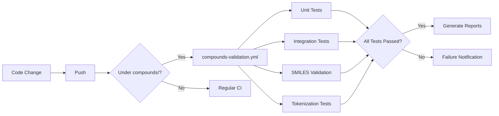

# Compounds Validation Guide

This guide explains how to validate the correctness of Compounds processing with GitHub Actions.

##  Validation Objectives

The following points are validated in the Compounds processing pipeline:

1. **SMILES tokenization** - Correct tokenization of SMILES strings
2. **SMILES validation** - Proper handling of valid and invalid SMILES
3. **Scaffold generation** - Accurate generation of molecular scaffolds
4. **Model integration** - Integration with BERT and GPT-2 models
5. **Data pipeline** - Data loading and preprocessing behavior

##  Quick Start

### 1. Run tests locally

```bash
# Run all Compounds tests
pytest tests/unit/test_compounds.py -v

# Unit tests only
pytest tests/unit/test_compounds.py -m "unit and compound" -v

# Integration tests only
pytest tests/unit/test_compounds.py -m "integration and compound" -v

# Run a specific test class
pytest tests/unit/test_compounds.py::TestSmilesValidation -v

# With coverage
pytest tests/unit/test_compounds.py --cov=molcrawl.compounds --cov-report=html
```

### 2. Run with GitHub Actions

#### Automatic trigger (on push)

If you change files under `molcrawl/compounds/` and push, the workflow runs automatically:

```bash
# Modify Compounds-related code
git add molcrawl/compounds/utils/preprocessing.py
git commit -m "fix: improve SMILES validation"
git push

# -> GitHub Actions runs automatically
```

#### Manual trigger

```bash
# Run all tests
gh workflow run compounds-validation.yml -f test_level=all

# Unit tests only
gh workflow run compounds-validation.yml -f test_level=unit

# Integration tests only
gh workflow run compounds-validation.yml -f test_level=integration
```

##  Test Structure

### Unit Tests (fast)

**TestSmilesTokenization** - Core tokenization behavior

```python
# What is tested:
- Import of SmilesTokenizer
- Validation of SMILES regex pattern
- Basic tokenization (CCO -> ["C", "C", "O"])
```

**TestSmilesValidation** - SMILES validity checks

```python
# What is tested:
- Handling of valid SMILES (CCO, c1ccccc1)
- Handling of invalid SMILES (empty string, INVALID)
- Handling of complex SMILES (for example ibuprofen)
- Tracking of invalid SMILES statistics
```

**Execution example:**

```bash
pytest tests/unit/test_compounds.py::TestSmilesValidation::test_valid_smiles -v
```

**Expected results:**

```text
✓ Valid SMILES returns a scaffold (non-empty string)
✓ Invalid SMILES returns an empty string
✓ Statistics are tracked correctly
```

### Integration Tests (slower)

**TestCompoundsEndToEnd** - End-to-end pipeline

```python
# What is tested:
- Full SMILES -> Scaffold pipeline
- Batch processing (100 SMILES)
```

**TestCompoundsBERTIntegration** - BERT model integration

```python
# What is tested:
- Model loading
- Tokenizer loading
- Inference pipeline
```

**TestCompoundsGPT-2Integration** - GPT-2 model integration

```python
# What is tested:
- Model loading
- SMILES generation
- Validity of generated SMILES (50% or higher)
```

**Execution example (with model paths):**

```bash
# Set model paths via environment variables
export COMPOUNDS_BERT_MODEL_PATH=/path/to/bert/model
export COMPOUNDS_GPT2_MODEL_PATH=/path/to/gpt2/model

pytest tests/integration/test_compounds_pipeline.py -v
```

##  GitHub Actions Workflow

### Job 1: unit-tests

**Purpose**: Check code quality quickly with unit tests

**What runs**:

```yaml
- SMILES tokenization tests
- SMILES validation tests
- Basic data processing tests
```

**How to read results**:

-  Green: all tests passed
-  Red: test failed (check logs)
-  Orange: skipped tests

### Job 2: integration-tests

**Purpose**: Verify integrated behavior across modules

**What runs**:

```yaml
- pytest tests/unit/test_compounds.py -m "integration and compound"
  (runs tests tagged with the integration marker)
```

### Job 3: smiles-validation

**Purpose**: Validate quality of SMILES processing

**What runs**:

```python
# Check invalid SMILES rate
✓ Invalid SMILES rate <= 50% -> Pass
✗ Invalid SMILES rate > 50% -> Fail (warning)
```

**Example**:

```text
Invalid SMILES: 2/10 (20.00%)
✓ Invalid SMILES rate is acceptable
```

### Job 4: tokenization-tests

**Purpose**: Verify tokenizer component behavior

**What runs**:

```python
- Check SMI_REGEX_PATTERN
- Check SmilesTokenizer class
```

### Job 5: phase1-verification

**Purpose**: Phase 1 (functional verification) checks for BERT and GPT-2

**What runs**:

```yaml
- BERT model initialization test
- GPT-2 model initialization test
- Phase 1 report generation
```

##  How to Read Reports

After test execution, the following artifacts are generated:

### 1. compounds-unit-test-report.md

```markdown
# Compounds Unit Test Report

Date: 2026-01-05

✓ test_valid_smiles PASSED
✓ test_invalid_smiles PASSED
✓ test_smiles_tokenizer_import PASSED
```

### 2. compounds-integration-report.md

```markdown
# Compounds Integration Test Report

✓ test_smiles_to_scaffold_pipeline PASSED
Processed: 100 SMILES
Valid scaffolds: 100
```

### 3. compounds-validation-summary.md

```markdown
# Compounds Validation Summary

## Test Results

- Unit Tests: success
- Integration Tests: success
- SMILES Validation: success
- Tokenization Tests: success

 **All Compounds tests passed!**
```

##  Troubleshooting

### Tests are skipped

**Cause**: Missing dependencies (RDKit, transformers, etc.)

**Fix**:

```bash
pip install rdkit transformers torch pandas
```

### SMILES validation test fails

**Cause**: RDKit cannot parse a specific SMILES string

**How to check**:

```python
from rdkit import Chem
smiles = "YOUR_SMILES_HERE"
mol = Chem.MolFromSmiles(smiles)
print(mol)  # None means invalid SMILES
```

### Model integration tests are skipped

**Cause**: Model path is not configured

**Fix**:

```bash
# Set environment variables
export COMPOUNDS_BERT_MODEL_PATH=/path/to/bert/model
export COMPOUNDS_GPT2_MODEL_PATH=/path/to/gpt2/model

# Or pass them to pytest directly
pytest tests/integration/test_compounds_pipeline.py \
  --bert-model=/path/to/bert \
  --gpt2-model=/path/to/gpt2
```

##  Quality Criteria

### Pass criteria

| Test Item                   | Criterion                      |
| --------------------------- | ------------------------------ |
| Unit tests                  | 100% pass                      |
| Valid SMILES handling       | Scaffold is generated          |
| Invalid SMILES handling     | Returns empty string           |
| Invalid SMILES rate         | 50% or lower                   |
| GPT-2 generated validity    | 50% or higher                  |

### Warning criteria

| Item               | Warning Condition |
| ------------------ | ----------------- |
| Invalid SMILES rate| 30-50%            |
| Test execution time| Over 5 minutes    |

##  CI/CD Flow



##  Next Steps

### Path to Phase 1 completion

1.  Pass all unit tests
2.  Implement integration tests
3.  Run validation with real models
4.  Complete the Phase 1 report

### Add tests

```python
# Add to tests/unit/test_compounds.py
@pytest.mark.unit
@pytest.mark.compound
def test_your_new_feature():
    """Test for a new feature"""
    # test code
    pass
```

### Continuous improvement

- Raise test coverage to 80%+
- Reduce test runtime to under 3 minutes
- Cover all edge cases

##  References

- [pytest documentation](https://docs.pytest.org/)
- [RDKit documentation](https://www.rdkit.org/docs/)
- [Transformers documentation](https://huggingface.co/docs/transformers/)
- [SMILES notation](https://en.wikipedia.org/wiki/Simplified_molecular-input_line-entry_system)

---

If you have questions or issues, report them via GitHub Issues.
