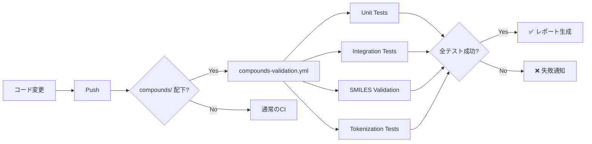

# Compounds（化合物）検証ガイド

このガイドでは、compounds（化合物）処理の正確性をGitHub Actionsで検証する方法を説明します。

## 🎯 検証の目的

Compounds処理パイプラインの以下を確認します：
1. **SMILES tokenization** - SMILES文字列の正しいトークン化
2. **SMILES validation** - 有効/無効なSMILESの適切な処理
3. **Scaffold generation** - Molecular scaffoldの正確な生成
4. **Model integration** - BERT/GPT2モデルとの統合
5. **Data pipeline** - データローディングと前処理

## 🚀 クイックスタート

### 1. ローカルでテストを実行

```bash
# 全てのcompoundsテストを実行
pytest tests/unit/test_compounds.py -v

# ユニットテストのみ
pytest tests/unit/test_compounds.py -m "unit and compound" -v

# 統合テストのみ
pytest tests/unit/test_compounds.py -m "integration and compound" -v

# 特定のテストクラスを実行
pytest tests/unit/test_compounds.py::TestSmilesValidation -v

# カバレッジ付き
pytest tests/unit/test_compounds.py --cov=src.compounds --cov-report=html
```

### 2. GitHub Actionsで実行

#### 自動実行（push時）
`src/compounds/` 配下のファイルを変更してpushすると自動実行されます：

```bash
# compounds関連のコードを変更
git add src/compounds/utils/preprocessing.py
git commit -m "fix: improve SMILES validation"
git push

# → GitHub Actionsが自動的に実行される
```

#### 手動実行
```bash
# 全テスト実行
gh workflow run compounds-validation.yml -f test_level=all

# ユニットテストのみ
gh workflow run compounds-validation.yml -f test_level=unit

# 統合テストのみ
gh workflow run compounds-validation.yml -f test_level=integration
```

## 📋 テスト構成

### ユニットテスト（高速）

**TestSmilesTokenization** - Tokenization の基本機能
```python
# テスト内容：
- SmilesTokenizer のインポート
- SMILES regex パターンの検証
- 基本的なトークン化（CCO → ["C", "C", "O"]）
```

**TestSmilesValidation** - SMILES の妥当性検証
```python
# テスト内容：
- 有効なSMILES（CCO, c1ccccc1）の処理
- 無効なSMILES（空文字、INVALID）の処理
- 複雑なSMILES（イブプロフェン等）の処理
- 無効SMILES統計の追跡
```

**実行例：**
```bash
pytest tests/unit/test_compounds.py::TestSmilesValidation::test_valid_smiles -v
```

**期待される結果：**
```
✓ 有効なSMILESはscaffoldを返す（空文字列ではない）
✓ 無効なSMILESは空文字列を返す
✓ 統計が正しく追跡される
```

### 統合テスト（時間がかかる）

**TestCompoundsEndToEnd** - End-to-End パイプライン
```python
# テスト内容：
- SMILES → Scaffold の完全なパイプライン
- バッチ処理（100個のSMILES）
```

**TestCompoundsBERTIntegration** - BERT モデル統合
```python
# テスト内容：
- モデルのロード
- Tokenizer のロード
- 推論パイプライン
```

**TestCompoundsGPT2Integration** - GPT2 モデル統合
```python
# テスト内容：
- モデルのロード
- SMILES生成
- 生成されたSMILESの妥当性（50%以上）
```

**実行例（モデルパス指定）：**
```bash
# 環境変数でモデルパスを指定
export COMPOUNDS_BERT_MODEL_PATH=/path/to/bert/model
export COMPOUNDS_GPT2_MODEL_PATH=/path/to/gpt2/model

pytest tests/integration/test_compounds_pipeline.py -v
```

## 🔍 GitHub Actions ワークフロー

### Job 1: unit-tests
**目的**: 高速なユニットテストでコード品質を確認

**実行内容**:
```yaml
- SMILES tokenization テスト
- SMILES validation テスト
- 基本的なデータ処理テスト
```

**結果の見方**:
- ✅ 緑色: 全テスト成功
- ❌ 赤色: テスト失敗（ログを確認）
- ⚠️ オレンジ: スキップされたテスト

### Job 2: integration-tests
**目的**: モジュール間の統合動作を確認

**実行内容**:
```yaml
- データパイプライン統合テスト
- SMILES前処理パイプライン
```

### Job 3: smiles-validation
**目的**: SMILES処理の品質を確認

**実行内容**:
```python
# 無効SMILES率をチェック
✓ Invalid SMILES率が50%以下 → Pass
✗ Invalid SMILES率が50%超 → Fail（警告）
```

**例**:
```
Invalid SMILES: 2/10 (20.00%)
✓ Invalid SMILES rate is acceptable
```

### Job 4: tokenization-tests
**目的**: Tokenizer コンポーネントの動作確認

**実行内容**:
```python
- SMI_REGEX_PATTERN の確認
- SmilesTokenizer クラスの確認
```

### Job 5: phase1-verification
**目的**: Phase 1（機能検証）のBERT/GPT2チェック

**実行内容**:
```yaml
- BERT モデル初期化テスト
- GPT2 モデル初期化テスト
- Phase 1 レポート生成
```

## 📊 レポートの見方

テスト実行後、以下のレポートがartifactとして生成されます：

### 1. compounds-unit-test-report.md
```markdown
# Compounds Unit Test Report
Date: 2026-01-05

✓ test_valid_smiles PASSED
✓ test_invalid_smiles PASSED
✓ test_smiles_tokenizer_import PASSED
```

### 2. compounds-integration-report.md
```markdown
# Compounds Integration Test Report

✓ test_smiles_to_scaffold_pipeline PASSED
  Processed: 100 SMILES
  Valid scaffolds: 100
```

### 3. compounds-validation-summary.md
```markdown
# Compounds Validation Summary

## Test Results
- Unit Tests: success ✅
- Integration Tests: success ✅
- SMILES Validation: success ✅
- Tokenization Tests: success ✅

✅ **All Compounds tests passed!**
```

## 🛠️ トラブルシューティング

### テストがスキップされる

**原因**: 依存関係（RDKit、transformers等）が不足

**解決方法**:
```bash
pip install rdkit transformers torch pandas
```

### SMILES validation テストが失敗

**原因**: RDKitが特定のSMILESを解析できない

**確認方法**:
```python
from rdkit import Chem
smiles = "YOUR_SMILES_HERE"
mol = Chem.MolFromSmiles(smiles)
print(mol)  # None の場合は無効なSMILES
```

### モデル統合テストがスキップされる

**原因**: モデルパスが設定されていない

**解決方法**:
```bash
# 環境変数を設定
export COMPOUNDS_BERT_MODEL_PATH=/path/to/bert/model
export COMPOUNDS_GPT2_MODEL_PATH=/path/to/gpt2/model

# または pytest 実行時に指定
pytest tests/integration/test_compounds_pipeline.py \
  --bert-model=/path/to/bert \
  --gpt2-model=/path/to/gpt2
```

## 📈 品質基準

### 合格基準

| テスト項目 | 基準 |
|----------|------|
| ユニットテスト | 100% pass |
| 有効SMILES処理 | scaffoldが生成される |
| 無効SMILES処理 | 空文字列を返す |
| Invalid SMILES率 | 50%以下 |
| GPT2生成SMILES妥当性 | 50%以上 |

### 警告基準

| 項目 | 警告条件 |
|------|---------|
| Invalid SMILES率 | 30-50% |
| テスト実行時間 | 5分以上 |

## 🔄 CI/CDフロー



## 📝 次のステップ

### Phase 1 完了への道
1. ✅ ユニットテストを全てパスさせる
2. ✅ 統合テストを実装する
3. 🔲 実際のモデルで検証を実行
4. 🔲 Phase 1 レポートを完成させる

### テストの追加
```python
# tests/unit/test_compounds.py に追加
@pytest.mark.unit
@pytest.mark.compound
def test_your_new_feature():
    """新機能のテスト"""
    # テストコード
    pass
```

### 継続的改善
- テストカバレッジを80%以上に
- テスト実行時間を3分以内に
- 全てのエッジケースをカバー

## 📚 参考資料

- [pytest ドキュメント](https://docs.pytest.org/)
- [RDKit ドキュメント](https://www.rdkit.org/docs/)
- [Transformers ドキュメント](https://huggingface.co/docs/transformers/)
- [SMILES 記法](https://en.wikipedia.org/wiki/Simplified_molecular-input_line-entry_system)

---

**質問や問題がある場合は、GitHub Issuesで報告してください。**
